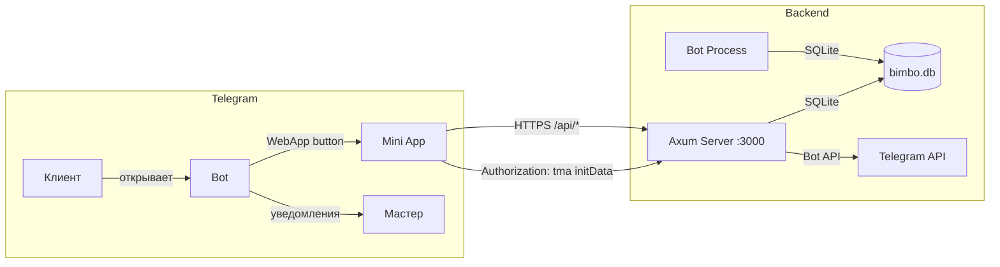
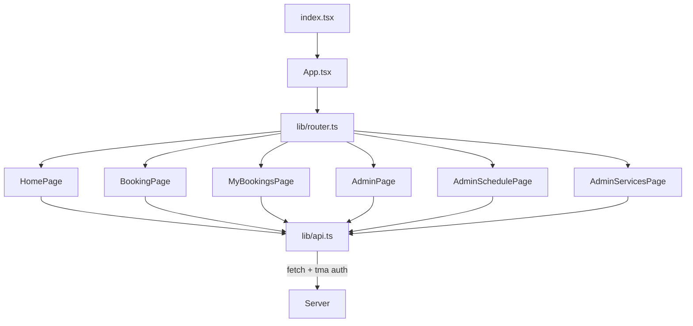
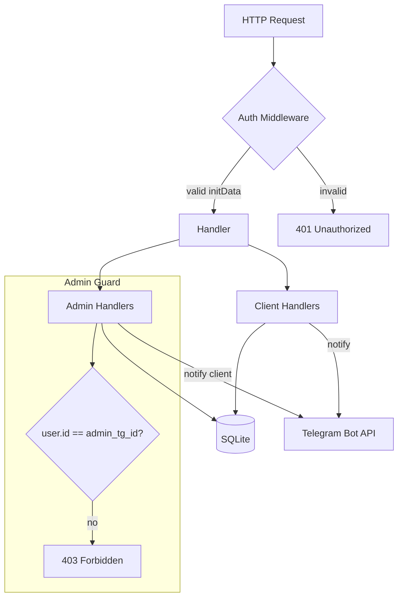
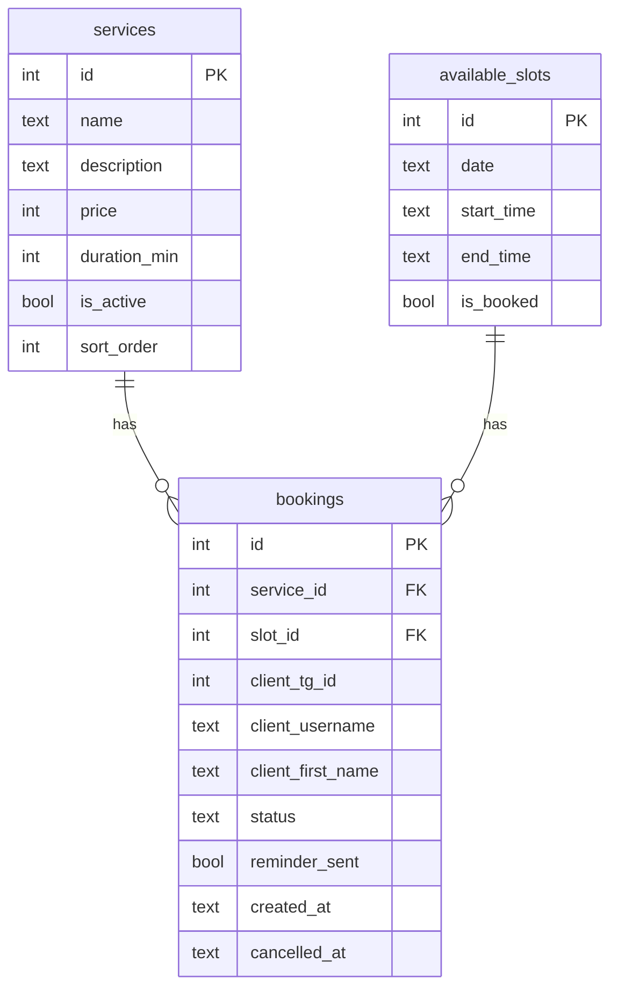
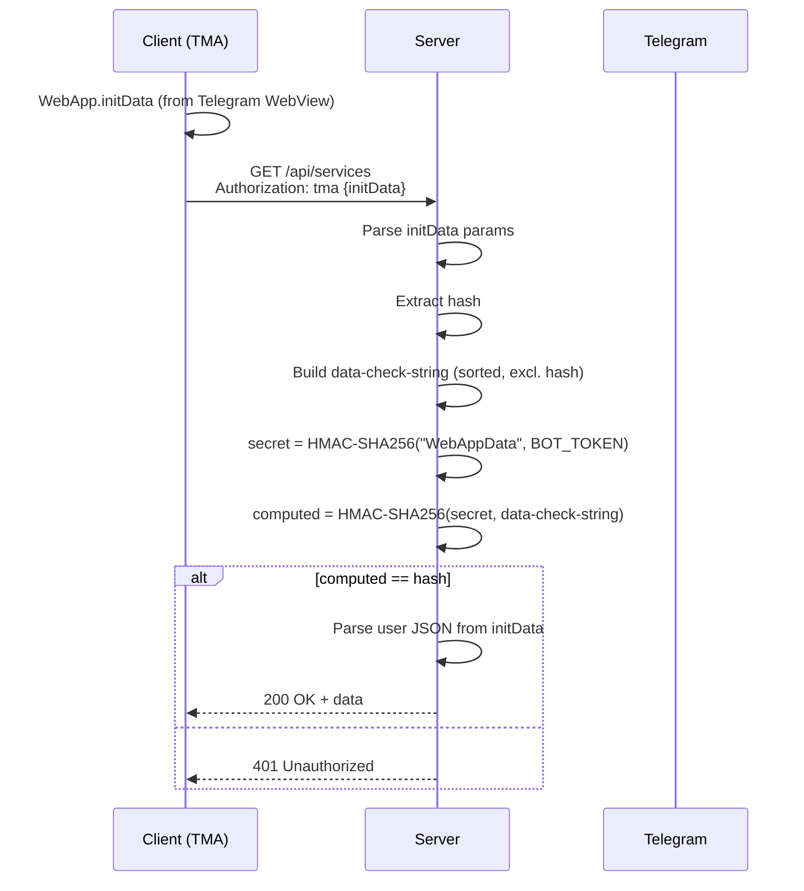
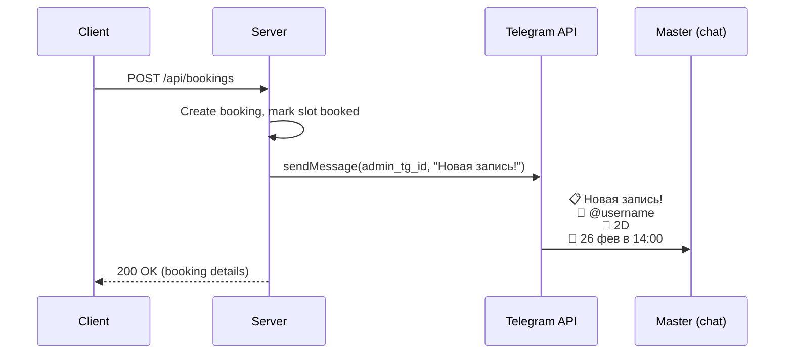
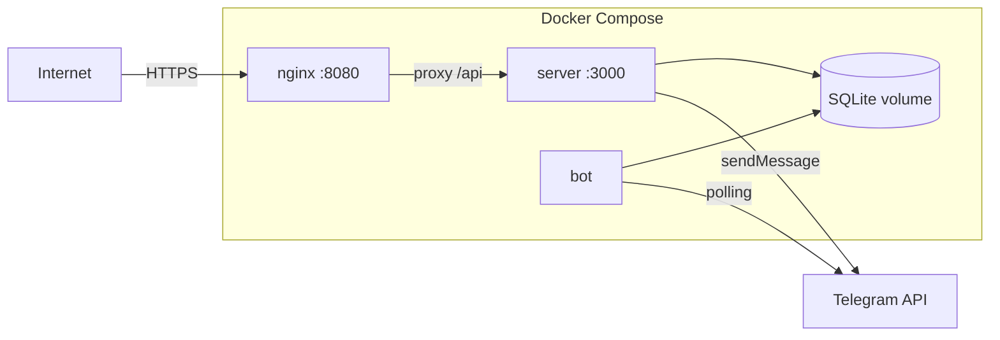

# Architecture Design Doc: Bimbo Lashes

## Overview

Система состоит из трёх компонентов, упакованных в Rust workspace + отдельный
Node.js проект для фронтенда.



## Компоненты

### 1. Frontend (apps/web)



**Решения:**
- **Solid.js** вместо React — меньше бандл, быстрее рендер, реактивность без Virtual DOM
- **Tailwind v4** — утилитарные стили, тёмная тема через CSS-переменные Telegram
- **Нет роутера-библиотеки** — простой сигнал `route` достаточен для 6 экранов
- **@twa-dev/sdk** — типизированный доступ к WebApp API

### 2. Backend (apps/server)



**Решения:**
- **Axum 0.8** — самый производительный Rust web-framework, тайп-сейф
- **SQLite** через sqlx — один мастер, < 100 записей/день, не нужен PostgreSQL
- **WAL mode** — для конкурентного доступа из server + bot
- **HMAC-SHA256 валидация** initData на каждом запросе
- **reqwest** для отправки уведомлений через Bot API (а не через teloxide в server)

### 3. Bot (apps/bot)

```mermaid
graph TD
    TG[Telegram Updates] --> DISP[Dispatcher]
    DISP --> CMD[Command Handler]
    DISP --> CB[Callback Handler]

    CMD --> START[/start — WebApp button]
    CMD --> MYBK[/mybookings — список записей]
    CMD --> TODAY[/today — записи на сегодня]
    CMD --> TOMORROW[/tomorrow — записи на завтра]
    CMD --> HELP[/help]

    CB --> CANCEL[cancel:ID — клиент отменяет]
    CB --> ACANCEL[admin_cancel:ID — мастер отменяет]

    REMIND[Reminder Task] -->|каждый час| DB[(SQLite)]
    REMIND -->|sendMessage| TG
```

**Решения:**
- **teloxide 0.13** — стабильный, хорошо документированный Telegram bot framework
- **dptree** — функциональный диспатчер, разделение command/callback веток
- **Фоновый таск** с `tokio::time::interval` для напоминаний (не cron)

## Data Model



## Auth Flow



## Notification Flow



## Deployment



## ADR: Почему SQLite, а не PostgreSQL

**Контекст:** один мастер, < 100 записей в день, < 1000 записей в месяц.

**Решение:** SQLite в WAL mode.

**Аргументы за:**
- Zero-config: не нужен отдельный сервер БД
- Один файл — простой бэкап (cp bimbo.db bimbo.db.bak)
- Latency < 1ms для всех запросов
- Docker volume вместо отдельного контейнера

**Риски:**
- Конкурентная запись из server + bot → WAL mode решает
- Масштабирование на несколько мастеров → миграция на PostgreSQL (v2.0)
